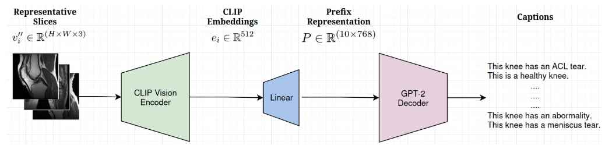

## Knee-MRI-Captioning

The problem setting is medical image captioning for knee MRI diagnosis using 3D volumetric scans as inputs. Each MRI volume $V \in \mathbb{R}^{(S \times H \times W)}$ contains $S$ slices of dimensions $H \times W$ pixels. The dataset provides binary pathology annotations $y = [y_{acl}, y_{meniscus}, y_{abnormal}] \in \{0,1\}^3$, where $y_{acl}$ indicates anterior cruciate ligament tears, $y_{meniscus}$ denotes meniscal tears, and $y_{abnormal}$ represents any pathological finding. We map these binary labels to natural language descriptions: $f(y) \xrightarrow{} \text{Healthy knee} \hspace{4pt}\text{if}\hspace{3pt} y_{abnormal} = 0$, otherwise concatenating present pathologies as "ACL tear and Meniscus tear" when multiple conditions exist. The core challenge is learning a mapping function $\Phi: \mathbb{R}^{(S \times H \times W)} \xrightarrow{} L$ where $L$ represents the space of medical caption strings, requiring the model to extract relevant anatomical and pathological features from the high-dimensional volumetric data.

## Approach

The model architecture implements a multimodal encoder-decoder framework that combines CLIP's visual encoder with GPT-2's language generation capabilities through a learned projection mechanism. Given an MRI volume $V \in \mathbb{R}^{(S \times H \times W)}$, the system first selects $K$ representative slices using uniform sampling: $S_{\text{selected}} = \{s_i \mid i \in \text{linspace}(0, S-1, K)\}$ where $K=10$ slices are chosen to capture spatial variations across the volume. Each selected slice $v_i \in \mathbb{R}^{(H \times W)}$ undergoes normalization $v'_i = ((v_i - \text{min}(v_i))/(\text{max}(v_i) - \text{min}(v_i))) * 255$ and conversion to 3-channel RGB format $v''_i \in \mathbb{R}^{(H \times W \times 3)}$ by replicating the grayscale channel. The frozen CLIP ViT-B/32 encoder processes each slice to produce embeddings $e_i = \text{CLIP}_{\text{encoder}}(v''_i) \in \mathbb{R}^{512}$, which are then aggregated via mean pooling. The main idea behind our approach essentially lies in the prefix projection mechanism where a learned linear transformation $W \in \mathbb{R}^{(512 \times 7680)}$ maps the scan embedding to a prefix representation: $P = \text{reshape}(W · e_i, (L_{\text{prefix}}, d_{\text{emb}}))$ where $L_{\text{prefix}}=10$ are the prefix tokens and $d_{\text{emb}}=768$ corresponds to GPT-2's embedding dimension. During forward propagation, the prefix embeddings $P \in \mathbb{R}^{(10 \times 768)}$ are concatenated with GPT-2's word embeddings of the target caption $E_{\text{caption}} \in \mathbb{R}^{(L_{\text{cap}} \times 768)}$ to form the complete input sequence $E_{\text{full}} = \text{concat}(P, E_{\text{caption}}) \in \mathbb{R}^{((10+L_{\text{cap}}) \times 768)}$. The attention mechanism operates over this combined sequence with an extended attention mask, while the loss computation uses shifted labels, ensuring gradient flow only affects caption generation tokens. The autoregressive generation process conditions on the prefix embedding through GPT-2's self-attention, enabling the model to generate medically relevant captions.

## Training Configuration
The training configuration has a strategic parameter freezing approach where all CLIP model parameters remain frozen to preserve the pre-trained visual representations, while only the caption model parameters are trainable, specifically the linear projection layer $\mathbb{W} \in \mathbb{R}^{(512\times 7680)}$ that maps CLIP embeddings to GPT-2's prefix space and the entire GPT-2 model. For optimization we use the \textit{AdamW} optimizer with learning rate $\alpha = 5\times 10^{-5}$ and weight decay $\lambda = 0.01$. The loss function employs standard cross-entropy criterion where only caption tokens contribute to the loss, enabling the model to learn caption generation while leveraging fixed visual features. Training uses a batch size of 8 due to memory constraints from processing multiple MRI slices per sample, with 25 epochs and early stopping based on validation loss to prevent overfitting. The model processes $K=10$ uniformly sampled slices per MRI volume, balancing computational efficiency with spatial coverage, while the prefix length $L_{\text{prefix}}=10$ provides sufficient conditioning context without overwhelming the 50 token maximum caption length. Last but not least, we subsampled the data to obtain 83 samples per category to balance out the distribution.

## Results
To evaluate the framework we adhere to the following strategy. On the holdout set, we generate the captions and then we map those captions to multiclass predictions as follows. If the caption contains the words "Unspecified Abnormality" we map it to the "abnormal" class, if it contains the phrase "ACL and Meniscus Tears" we map it to the corresponding class and so on. As a result, we can compute the model's accuracy per class and globally. We trained one model for each of the three available planes, axial, coronal and saggital, along with one model trained on all three planes. The following table showcases the models performance.  

| Task           | Axial   | Coronal | Sagittal | All    |
|----------------|---------|---------|----------|--------|
| **Abnormal**   | **69.32** | 68.23  | 67.77    | 64.66 |
| **ACL tear**   | **49.13** | 48.55  | 48.61    | 45.88 |
| **Meniscus tear** | 51.28 | **53.15** | 51.23 | 48.57 |
| **Macro mean** | 56.58  | **56.64** | 55.87    | 53.04 |

**Table:** Validation accuracy (%) of the proposed method on the **MRNet** dataset. Best plane for each task is in **bold**.
